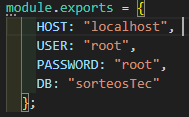
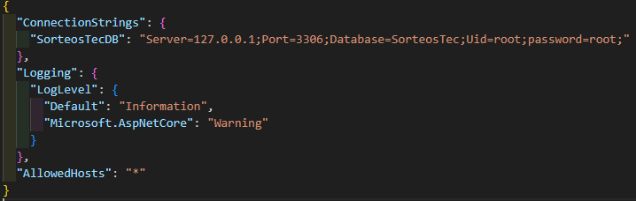
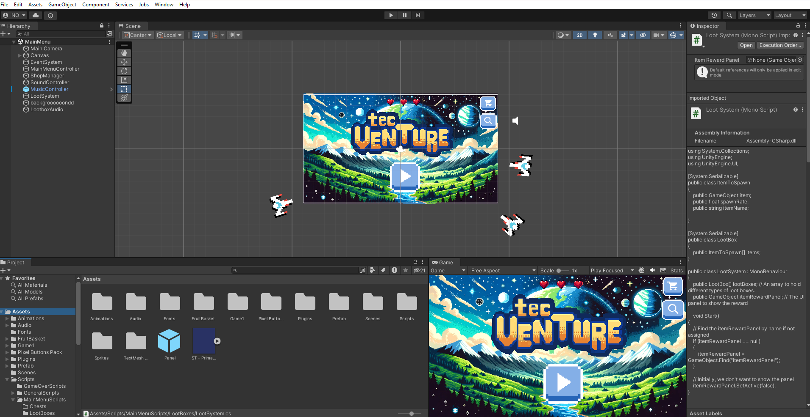
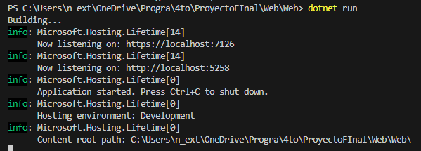

# SorteosTec

## Descripción

Este proyecto es una aplicación web para Sorteo Tec que permite jugar minijuegos relacionados con tematica del tec para ganar premios.

## Instalación

### 1. Pre-requisitos

1. Conocimiento básico de Git y GitHub.
2. Conocimiento básico de HTML, CSS, JavaScript y C#.
3. Conocimiento básico de Node.js y Express.js.
4. Instalar [Git](https://git-scm.com/downloads).
5. Instalar [Node.js](https://nodejs.org/es/download/).
6. Instalar [SQL Server](https://dev.mysql.com/downloads/mysql/) y un cliente de MySQL como [MySQL Workbench](https://dev.mysql.com/downloads/workbench/).


### 2. Clonación de repositorio

1. Clonar el repositorio.
```bash
git clone https://github.com/NarhariOlalde/SorteosTec.git
```
### 3. Instalación de dependencias

#### API
1. Abrir una terminal en la carpeta del proyecto.
2. Instalar dependencias.
```bash
cd /Web/API/
npm install express mysql2
```

## 3. Configuración

### 1. Configuración de base de datos
1. Abrir MySQL Workbench.
2. Crear una nueva conexión con los siguientes datos:
    - Hostname: localhost
    - Port: 3306
    - Username: root
    - Password: root
3. Abrir el archivo [`DataBase/SinBouldersSQL.sql`](DataBase/SinBouldersSQL.sql) y ejecutarlo en la conexión creada.
4. Ejecutar los archivos .sql presentes en la carpeta ['DataBase/Querys'](DataBase/Querys) en la conexión creada.

Si los pasos anteriores se realizaron correctamente, se deberá tener una base de datos llamada `sorteostec` con las siguientes tablas y stored procedures:


### 2. Configuración de API
1. Abrir el archivo [`db.config.js`](Web/API/config/db.config.js) y modificar los valores de las variables `host`, `user`, `password` y `DB` con los datos de la conexión creada en el paso anterior.

Deberia lucir como lo siguiente:




### 3. Configuración de Frontend
1. Abrir el archivo [`appsetting.json`](Web\Web\appsettings.json) y modificar los valores de las variables `server`, `port`, `database`, `uid` y `password` con los datos de la conexión creada en el paso anterior.

Deberia lucir como lo siguiente:



### 4. Configuración de Juego en Unity
1. Abrir Unity Hub.
2. Abrir el proyecto [`SpaceShip`](Unity/Game3/SpaceShip/) con la versión 2022.3.9f1 de Unity.

Deberia lucir como lo siguiente:




## 4. Ejecución
### 1. Ejecucion de la Base de Datos
1. Abrir MySQL Workbench.
2. Abrir la conexión creada en la sección de configuración.

### 2. Ejecución de API
1. Abrir una terminal en la carpeta del proyecto.
2. Ejecutar el comando los siguientes comandos:
```bash
cd /Web/API/
node app.js
```

### 3. Ejecución de Frontend
1. Abrir una terminal en la carpeta del proyecto.
2. Ejecutar el comando los siguientes comandos:
```bash
cd /Web/Web/
dotnet run
```
3. Abrir un navegador web y acceder a la dirección mostrada en la terminal.
Ejemplo:



Es importante recalcar que el videojuego de Unity ya esta embebido, por lo que no es necesario ejecutarlo por separado. En caso de necesitar modificarlo, se puede abrir con Unity Hub y seguir el [procedimiento para embeber un juego en una pagina web](https://sorceryforce.net/en/tips/unity-publish-webgl-asp-net-core).


